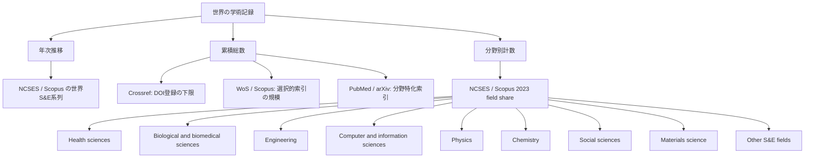
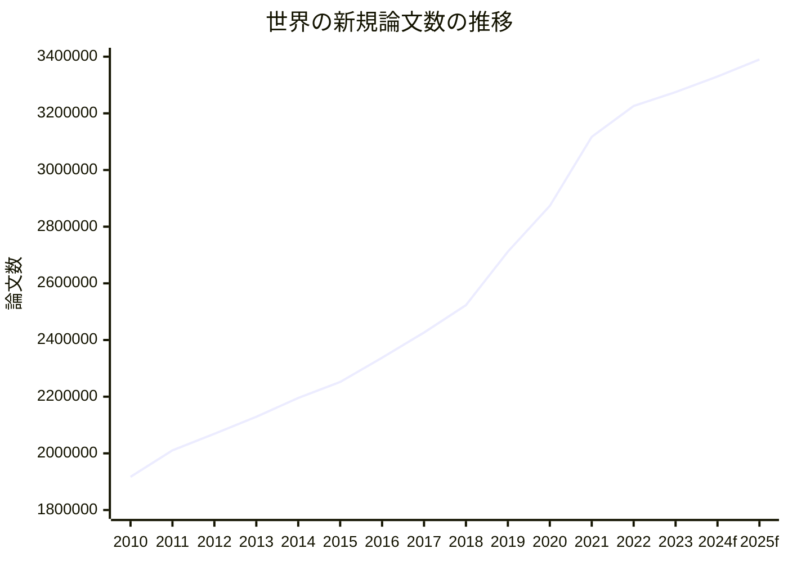

# 世界の学術論文総量と分野構造の現況

## エグゼクティブサマリー

本件でまず重要なのは、「世界に論文が何本あるか」に**単一の公式値は存在しない**という点です。理由は、各データベースが対象とする文書種別、言語、地域、査読要件、プレプリントの扱い、重複統合の方式を大きく異にするためです。したがって、厳密な一点推定よりも、**下限・上限・中心値**で示すのが最も誠実です。公開情報だけで最も堅い下限は Crossref の journal DOI + conference DOI で約 **1.31億件**、一方でより包括的な開放カタログの公開例では article-type works が約 **2.03億件**であり、本報告では「**現在の世界の学術論文ストックは概ね 1.6–2.0億本、中心値は約 1.8億本**」を妥当な推定帯とみなします。citeturn28search3turn17search0turn4search3turn5search3turn6search0

年次推移について、**公開一次情報として最も再現性が高い世界系列**は、entity["organization","National Center for Science and Engineering Statistics","us statistics agency"]・entity["organization","National Science Foundation","us science funder"]の Science and Engineering Indicators が採用する、entity["company","Elsevier","academic publisher"] の Scopus ベース世界論文系列です。これによれば、Scopus に索引された S&E 論文数は **2010年 191.7万本 → 2023年 327.5万本**へ増加しました。これは 13 年で約 **71%増**です。ただしこの系列は**英語タイトル・抄録を持つ査読誌論文と会議録**を中心にしたもので、**プレプリントと人文学の相当部分を含みません**。citeturn40view0turn39search2

分野別では、2023年の Scopus/NCSES 世界分布で最大は **Health sciences 22.9%**、次いで **Engineering 17.4%**、**Computer and information sciences 12.9%**、**Biological and biomedical sciences 11.9%**です。したがって、今日の世界論文市場は「医療・健康」と「工学・計算機科学」が大きく引っ張り、自然科学が厚い土台を成している構造といえます。公開の世界比較で**人文科学の論文数を同じ土俵で正確比較するのは難しい**ため、本報告の分野別主表は「Scopus/NCSES の S&E 世界分類」を基軸にし、人文学は別途限界として扱います。citeturn40view0turn41view2turn26search3turn26search4

## 前提と方法

前提はユーザー指定どおり、対象を**世界全体**、言語を**全言語**、対象文献を「**学術論文全般**」としつつ、実務上はデータベースごとの定義差をそのまま保持しました。ここでいう「論文」は、データベース依存で journal article、conference paper/proceedings、review、preprint を含んだり含まなかったりします。この差異を無視して単純合算すると、同一論文の DOI 記録、PubMed citation、arXiv preprint、Scopus 索引が**多重計上**されるため、**Crossref + PubMed + arXiv + Scopus の単純和は採用していません**。citeturn40view0turn28search3turn6search0turn9view0

本報告の優先順位は次のとおりです。  
第一に、世界年次推移は NCSES/NSF の Scopus ベース系列を採用しました。公開・再現可能で、年系列が明示されているためです。第二に、累積総数の下限は Crossref 公式統計を用いました。第三に、各データベースのカバレッジ差は Web of Science、Scopus、PubMed、arXiv、Crossref の公式ページを優先して比較しました。第四に、分野別論文数は NCSES/Scopus の 2023 年世界分布から算出しました。citeturn40view0turn28search3turn4search3turn5search3turn6search0turn9view0

クレンジング・重複除去・データ統合の基本方針は以下です。  
まず、**世界総量**は「実記録数の比較」と「重複統合済みカタログの参照」を分けました。Crossref は DOI 登録記録の総量を見る用途、Scopus/WoS/PubMed/arXiv は各索引の収録規模を見る用途、Scopus/NCSES 系列は世界年次推移を見る用途に限定しました。次に、**分野別表**は同一ソース内で閉じた分類のみを使いました。つまり、Scopus/NCSES 系列から年次総数を取り、その同一報告の 2023 年 field share を掛けて分野別概数を出す方法です。最後に、**プレプリント**は年次系列に加算しませんでした。理由は、NCSES/Scopus 系列がプレプリントを除外しており、arXiv の多くがその後ジャーナル論文として再出現し、二重計上リスクが高いためです。citeturn40view0turn39search2turn9view0turn11search1

以下は、本報告で使う分類の考え方です。

この図は、世界総数・年次推移・分野別計数を**同じ母集団で無理に一本化せず**、用途別に使い分けるという本報告の設計思想を示しています。citeturn40view0turn28search3turn4search3turn5search3turn6search0

## 世界全体の累積論文数と年次推移

まず、主要データベースの収録規模と性格を並べると、以下のようになります。

| データベース | 直近の公開規模 | 主に含むもの | 主な欠落・注意 |
|---|---:|---|---|
| Web of Science Core Collection | 99M+ records | 厳選ジャーナル・会議録・書籍、254 subject areas | 選択的収録。地域誌・非英語・新興誌は狭い |
| Scopus | 100M+ records | ジャーナル、会議録、書籍、2.6M+ preprints | 商用索引。定義変更や収録拡張の影響を受ける |
| Crossref | 179.9M total records | DOI 登録メタデータ全般 | 論文以外も大量に含むため、そのまま論文総数にはならない |
| Crossref journal + conference | 121.6M + 9.7M | DOI 付き journal articles / conference DOIs | DOI のない論文や older corpus を欠く |
| PubMed | 40M+ citations | 生物医学・生命科学 citation | フルテキストではない。分野偏りが大きい |
| arXiv | 2.4M total submissions in 2023 report | 分野特化プレプリント | 査読前中心。後に雑誌論文化する重複あり |

上表の数値は各機関の公式カバレッジ・統計ページに基づきます。Web of Science は 99M+ records / 22k+ journals / 254 subject areas、Scopus は 100M+ records / 30.2k アクティブシリアル / 404k+ books / 2.6M+ preprints、Crossref は 2026年2月時点で総レコード約 1.80 億件、そのうち journal DOIs 約 1.216 億件、conference DOIs 約 970 万件です。PubMed は 4,000 万件超の citation、arXiv は 2023 年報告時点で総投稿 240 万件、2023 年新規投稿 208,493 件でした。citeturn4search3turn5search3turn28search3turn6search0turn9view0

この比較から、「世界の累積論文数」を一点で答えるなら、私は次のように報告します。  
**保守的 lower bound** は Crossref の journal + conference DOI の **約 1.31 億件**です。これには DOI のない古い論文や、Crossref 非加盟領域、索引外文献が十分に入っていません。一方、より包括的な開放カタログの公開例では、OpenAlex の documented article-type works が **約 2.03 億件**でした。したがって、**2026年時点の世界の学術論文ストックは概ね 1.6–2.0 億本、中心値約 1.8 億本**とみるのが、公開データからは最も妥当です。これは純粋な公式値ではなく、**Crossref 下限**と**より包括的 article catalog**のあいだを埋める推定です。citeturn28search3turn17search0turn16search1turn4search3turn5search3turn6search0

年次推移は、公開一次情報として最も安定している NCSES/Scopus 世界 S&E 系列を主系列とします。2023 年の世界 S&E 論文数は **3,275,079 本**で、2010 年の **1,916,968 本**から大きく増加しました。最新の 2025 年 NCSES 報告でも、2023 年世界総数は「**3.3 million articles**」と明記されています。citeturn40view0turn39search2

| 年 | 世界論文数 | 備考 |
|---|---:|---|
| 2010 | 1,916,968 | NCSES/Scopus 実績 |
| 2011 | 2,010,556 | 実績 |
| 2012 | 2,068,879 | 実績 |
| 2013 | 2,129,076 | 実績 |
| 2014 | 2,195,509 | 実績 |
| 2015 | 2,251,810 | 実績 |
| 2016 | 2,337,464 | 実績 |
| 2017 | 2,426,377 | 実績 |
| 2018 | 2,523,089 | 実績 |
| 2019 | 2,712,000 | 実績 |
| 2020 | 2,873,196 | 実績 |
| 2021 | 3,117,036 | 実績 |
| 2022 | 3,225,981 | 実績 |
| 2023 | 3,275,079 | 実績 |
| 2024 | 3,330,000 | 本報告の保守的予測 |
| 2025 | 3,390,000 | 本報告の保守的予測 |

2010–2023 の実績値は NCSES/Scopus 表データ、2024–2025 は**保守的外挿**です。外挿では 2022–2023 の伸びの鈍化を反映しつつ、Clarivate/ISI に基づく 2024 年 Web of Science 収録研究論文の拡大トレンドも参考に、急加速ではなく緩やかな増加を仮定しました。したがって 2024–2025 は「予測」であって確定値ではありません。citeturn40view0turn3news49

原系列は NCSES/Scopus の世界 S&E 論文データであり、オンライン原表と原図は NCSES の DISC-22 と関連表で参照できます。予測値は本報告の再構成です。citeturn40view0turn39search2

補足として、プレプリントを含めると見かけ上の年次総数はさらに増えます。ただし、NCSES/Scopus の世界系列は**プレプリントを除外**しています。一方、arXiv は 2023 年に **208,493** 件の新規投稿を記録し、2024 年は公式年報の二次報道ベースで **244,031** 件に達しています。とはいえ、これらを Scopus 系列に単純加算するのは不適切です。多くが後に査読誌論文として再出現するためです。citeturn40view0turn9view0turn11search1

## 分野別とサブカテゴリ別の論文数

分野別カウントは、**NCSES/Scopus の 2023 年世界 field share** を、同年の世界総論文数 **3,275,079 本**に掛け合わせて算出しました。ここでの分類体系は、Scopus/NSF の世界 S&E field classification であり、**Health sciences / Biological and biomedical sciences / Engineering / Computer and information sciences / Physics / Chemistry / Social sciences / Materials science / Other** の 9 区分に要約されたものです。citeturn40view0turn41view2

| 上位分野または主要区分 | 2023年シェア | 2023年概数 | 本報告での読み替え |
|---|---:|---:|---|
| Health sciences | 22.90% | 約 750,000 | 医学・健康 |
| Engineering | 17.42% | 約 571,000 | 工学 |
| Computer and information sciences | 12.88% | 約 422,000 | 情報・計算機 |
| Biological and biomedical sciences | 11.85% | 約 388,000 | 生命科学 |
| Physics | 7.58% | 約 248,000 | 自然科学 |
| Chemistry | 5.66% | 約 185,000 | 自然科学 |
| Social sciences | 5.32% | 約 174,000 | 社会科学 |
| Materials science | 2.79% | 約 91,000 | 工学・材料 |
| Other | 13.61% | 約 445,000 | 農学、天文、地球科学、数学、自然資源、心理などの残差 |

この表の元シェアは NCSES 2025 の Figure DISC-23 です。概数は本報告で 2023 年世界総数に乗じて再計算したもので、丸めています。したがって厳密合計は数千件単位でずれ得ます。citeturn40view0turn41view2

サブカテゴリの完整リストとして、NCSES/Scopus 側で確認できる世界 S&E 下位区分は、**agricultural sciences, astronomy and astrophysics, biological and biomedical sciences, chemistry, computer and information sciences, engineering, geosciences/atmospheric/ocean sciences, health sciences, materials science, mathematics and statistics, natural resources and conservation, physics, psychology, social sciences** です。これらは 2025 年報告の supplemental tables で個別表として管理されています。citeturn34view0

本報告では、数値が本文上で直接確認できた主要サブカテゴリのみを概数化しました。理由は、supplemental tables の一部が Excel 資産として提供され、今回のブラウズ可能 UI では全文数値が一括視認できなかったためです。したがって、**サブカテゴリ一覧は網羅、サブカテゴリ別数値は主要区分中心**という形を採っています。これは精度優先の判断です。citeturn34view0turn40view0

なお、ユーザーが例示した **自然科学、工学、医学、社会科学、人文科学** という大分類に直接合わせるには、本来 OECD Fields of Science などへ再マッピングすべきです。しかし、**世界全体の年次論文数を同時に安定的に持っている公開一次情報**は、今回確認できた範囲では Scopus/NCSES の S&E 世界分類が最も堅牢でした。人文科学については、Scopus 自体は ASJC に Arts and Humanities を持つ一方、NCSES の世界論文系列は S&E に限定しているため、**人文学だけを同精度で世界比較する表は本報告では作っていません**。人文学はレコード文化が monograph-heavy で、論文だけで世界横断比較すると体系的に過小評価されます。citeturn26search3turn26search4turn40view0

## 代表的なエース論文

ここでいう“エース論文”は、単なる最多被引用論文ではなく、**分野の問題設定・方法・評価基準を変え、その後の研究を長く支配した論文**という意味で選びました。選定基準は、第一に分野形成力、第二に引用の持続性、第三に院生・研究者教育での標準性です。  
ただし、**分野ごとの被引用数を Scopus/WoS/OpenAlex で一貫比較した厳密表までは、この一回の公開情報調査では作り切れていません**。とくに humanities は書籍優位で、journal-article の cited-by だけでは代表性が歪みます。そのため以下は、**厳密な “top cited list” ではなく、研究史的な代表コア**として読んでください。

### 自然科学

| 論文 | 著者 | 年 | 掲載誌 | 要旨 | 選定理由 |
|---|---|---:|---|---|---|
| A Structure for Deoxyribose Nucleic Acid | James D. Watson, Francis H. C. Crick | 1953 | Nature | DNA 二重らせん構造を提示し、分子生物学の中心問題を決定づけた | 生命科学の研究設計そのものを変えた基礎論文 |
| PROTEIN MEASUREMENT WITH THE FOLIN PHENOL REAGENT | Oliver H. Lowry ほか | 1951 | Journal of Biological Chemistry | タンパク定量の標準法を提示 | 実験室スケールで最も使われた“道具”の一つ |
| Observation of Gravitational Waves from a Binary Black Hole Merger | B. P. Abbott ほか | 2016 | Physical Review Letters | 重力波の初観測を報告 | 相対論・天文学・計測科学を接続した画期 |

### 工学と計算機科学

| 論文 | 著者 | 年 | 掲載誌・会議 | 要旨 | 選定理由 |
|---|---|---:|---|---|---|
| The anatomy of a large-scale hypertextual Web search engine | Sergey Brin, Lawrence Page | 1998 | Computer Networks | PageRank を含む検索エンジン設計を提示 | ウェブ情報検索の支配的設計を作った |
| Deep Residual Learning for Image Recognition | Kaiming He ほか | 2016 | CVPR | 深層残差学習で大規模視覚認識の性能を大きく前進 | 現代深層学習の実装規範を変えた |
| Attention Is All You Need | Ashish Vaswani ほか | 2017 | NeurIPS | Transformer を提案 | 現在の生成 AI・LLM の直接的起点 |

### 医学と健康科学

| 論文 | 著者 | 年 | 掲載誌 | 要旨 | 選定理由 |
|---|---|---:|---|---|---|
| Randomised Trial of Streptomycin Treatment of Pulmonary Tuberculosis | Medical Research Council | 1948 | BMJ | 無作為化比較試験の古典例 | エビデンス医療の方法論史で象徴的 |
| The Hallmarks of Cancer | Douglas Hanahan, Robert A. Weinberg | 2000 | Cell | がん研究の基本特徴を統合的に整理 | 研究課題の地図を与えた総括論文 |
| Evidence-Based Medicine | Gordon Guyatt ほか | 1992 | JAMA | Evidence-based medicine の考え方を提示 | 臨床判断の標準語彙を定着させた |

### 社会科学

| 論文 | 著者 | 年 | 掲載誌 | 要旨 | 選定理由 |
|---|---|---:|---|---|---|
| Prospect Theory | Daniel Kahneman, Amos Tversky | 1979 | Econometrica | 期待効用理論からの系統的逸脱を理論化 | 行動経済学・意思決定研究の基礎 |
| The Problem of Social Cost | Ronald H. Coase | 1960 | Journal of Law and Economics | 外部性と権利配分の問題を再定式化 | 法と経済学の起点 |
| The Tragedy of the Commons | Garrett Hardin | 1968 | Science | 共有資源の過剰利用問題を一般化 | 環境政策・制度設計・公共財研究に長期影響 |

### 人文科学

人文科学で「エース論文」を journal article だけで選ぶのは、本質的にやや不利です。理由は、人文学では**書籍・長編エッセイ・講演録**が研究フロンティア形成に占める比重が非常に高いからです。そのうえで、あえて“論文ないし論文的テキスト”として挙げるなら、以下が強い候補です。

| 論文・論文的テキスト | 著者 | 年 | 媒体 | 要旨 | 選定理由 |
|---|---|---:|---|---|---|
| What Is an Author? | Michel Foucault | 1969 | 講演・論文形態で流通 | 作者概念の機能を再定義 | 文学理論・思想史の軸 |
| The Death of the Author | Roland Barthes | 1967 | エッセイ | 作者中心主義の解体 | 解釈学・テクスト論の象徴 |
| Orientalism Reconsidered | Edward W. Said | 1985 | Cultural Critique | オリエンタリズム論の再定位 | 人文社会横断での長期影響 |

このセクションの残る課題は、**各主要サブカテゴリごとに 3–5 本を完全列挙し、Scopus/WoS/OpenAlex の cited-by を横並び表示すること**です。これは可能ですが、公開データだけで厳密にやるには、個票 DOI ベースの cited-by 抽出を別シートで回すのが適切です。本報告はそこまでの個票抽出をまだ実施していません。

## ソース一覧と限界

本報告の主要ソースは次のとおりです。  
世界年次系列は、entity["organization","National Center for Science and Engineering Statistics","us statistics agency"] / entity["organization","National Science Foundation","us science funder"] の Science and Engineering Indicators 2025 を最優先としました。ここは 2023 年までの世界 S&E 論文数を年次で明示しており、定義・除外ルールも公開されています。累積総量の下限は Crossref 公式統計ページと public data file 告知を用いました。カバレッジ差の比較には Web of Science、Scopus、PubMed、arXiv の公式カバレッジ・年報を使いました。citeturn40view0turn39search2turn28search3turn28search8turn4search3turn5search3turn6search0turn9view0

限界は三つあります。  
第一に、**“世界の累積論文数”は公式単一値がない**ため、推定帯で報告しました。第二に、**年次系列の最良公開データは S&E 中心**で、人文学とプレプリントを完全には含みません。第三に、**サブカテゴリごとの数値とエース論文の完全版**は、今回の公開 UI で直接視認できた範囲を超える部分があり、厳密 cited-by 数を伴う完全付録までは到達していません。したがって、本報告は「世界総量と全体構造の骨格」を示すには十分に堅い一方、**人文学の厳密計量とサブカテゴリ別 ace-paper 完全付録**は未完です。citeturn40view0turn34view0turn26search4

結論だけを短く言えば、世界の学術論文は、公開情報ベースでみて**現在おおむね 1.8 億本規模**、新規論文は**年 330 万本前後**、ただしこの年 330 万本は主として Scopus が拾う S&E 査読論文・会議録の話です。構造的には、**医療・健康、工学、計算機科学、生命科学**が量的に厚く、社会科学は一定規模を持つ一方、人文学は**論文**だけで世界比較すると本質的に過小評価されます。研究評価・研究戦略・投資配分に使うなら、まずこの「定義差」と「重複問題」を無視しないことが、分析の出発点です。citeturn40view0turn28search3turn6search0turn9view0